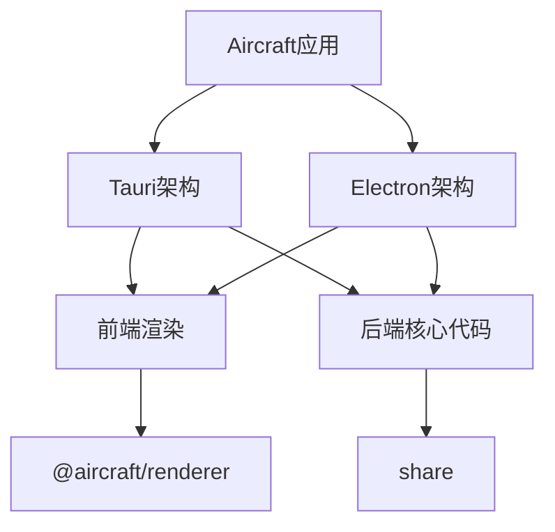

# Aircraft

## 项目架构

Aircraft项目采用了双架构设计，同时支持Tauri和Electron两种运行方式。

### 架构说明

- **双架构设计**：项目同时支持Tauri和Electron运行时环境，可根据需要选择不同的构建方式
- **Tauri架构**：基于Rust语言，使用tauri库构建本地应用，通过命令系统与前端交互
- **Electron架构**：基于Node.js，使用cordis上下文系统管理各种服务和插件
- **共享前端**：两种架构共享同一套前端渲染代码，通过不同的绑定方式与后端交互

### 关键组件

#### Tauri部分

- **lib.rs**: 核心模块，负责初始化应用和注册命令
- **命令系统**: 提供配置、服务器、热键、UI和LLM等功能的API
- **插件系统**: 集成Store、Autostart、Dialog和Shell等功能

#### Electron部分

- **context.ts**: 使用cordis上下文管理应用生命周期和组件依赖
- **服务层**: 提供窗口管理、托盘、配置、热键和IPC等核心服务
- **Rust绑定**: 通过RustBindings服务集成Rust编写的功能

#### 共享组件

- **前端渲染**: 统一的用户界面代码，可在两种架构中无缝运行
