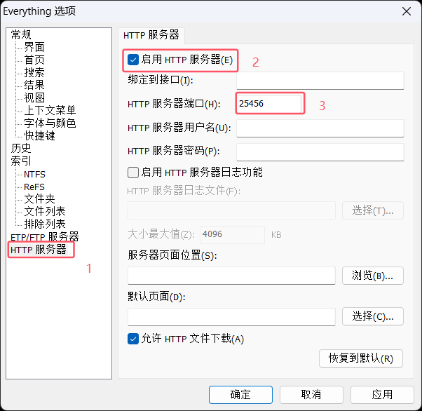

# 附件验证功能

## 功能介绍

v3.0.5 版本 Lims 插件已内置 **WASM 附件解析引擎**，可以直接在浏览器中解析和验证附件信息，无需安装额外的解析器软件。

附件验证功能主要包括：

- 📄 **概要文档解析**：自动读取本地概要文件（.docx）和图片文件（.pdf），提取关键信息

## 工作原理

### 1. WASM 解析引擎

插件集成了基于 Rust 编译的 WebAssembly 模块，具有以下优势：

- ✅ **操作简单**：所有模块都在浏览器中运行, 开箱即用
- ✅ **高性能**：接近原生速度的解析性能
- ✅ **跨平台**：支持所有主流浏览器和操作系统

### 2. 附件获取流程

```
用户点击验证按钮
    ↓
插件读取项目编号
    ↓
通过 Everything HTTP 服务搜索本地图片概要
    ↓
本地概要文件（.docx）和图片文件（.pdf）
    ↓
WASM 引擎解析文件内容
    ↓
提取关键数据（品名、型号、参数等）
    ↓
与检验单数据对比
    ↓
显示验证结果
```

## 前置条件

::: tip 提示
插件版本需要 v3.0.5 或更高版本
:::

### 必需条件

1. **Everything 搜索工具**
   - 用于快速搜索本地文件
   - 需要启用 HTTP 服务
   - [下载 Everything](https://www.voidtools.com/zh-cn/)

### 可选条件

2. **标签识别功能**（如需使用）
   - 需要在插件选项中启用
   - 会自动加载 ONNX 模型
   - 内存占用约增加 50MB

## 配置步骤

### 第一步：配置 Everything 服务

Everything 是一个免费的本地文件搜索工具，插件通过它来定位附件文件。

1. **下载并安装 Everything**
   - 访问 [Everything 官网](https://www.voidtools.com/zh-cn/)
   - 下载并安装最新版本

2. **启用 HTTP 服务**
   - 打开 Everything
   - 点击菜单：**工具** → **选项**
   - 切换到 **HTTP 服务器** 选项卡
   - 勾选 ☑️ **启用 HTTP 服务器**
   - 将端口设置为：`25456`
   - 点击 **应用** 和 **确定**



3. **保持 Everything 运行**
   - Everything 需要在后台运行
   - 可以设置开机自启动

::: warning 注意
端口号必须是 `25456`，这是插件默认配置的端口。如果修改端口，附件搜索功能将无法使用。
:::

### 第二步：启用插件附件验证功能 (已经默认开启)

1. **打开插件选项**
   - 右键点击浏览器工具栏的 Lims 插件图标
   - 选择 **选项**

2. **启用基础验证**
   - 在 **样品检验-主界面** 部分
   - 勾选 ☑️ **表单验证**（应该已经默认开启）

3. **配置标签检查（可选）**
   - 勾选 ☑️ **启用标签检查**（自动识别）
   - 或勾选 ☑️ **启用手动标签检查**（手动触发）
   - 注意：标签检查会增加内存占用


## 使用方法

### 基础附件验证

1. **打开检验单页面**
   - 在样品检验模块，打开任意检验单

2. **点击验证按钮**
   - 在页面右上角（或提交按钮旁边，取决于配置）
   - 点击 **验证** 按钮

3. **自动流程**

   ```
   插件会自动执行：
   → 读取当前项目编号
   → 通过 Everything 搜索本地附件
   → 使用 WASM 引擎解析概要和 UN 报告
   → 提取关键数据
   → 与检验单数据对比
   → 显示验证结果
   ```

4. **查看验证结果**

### 标签检查

**自动标签检查**（需开启）

- 验证时自动识别包装图片中的标签
- 自动判断标签是否正确
- 将标签检测结果图片放到检验单页面

**识别的标签类型**

- 9类杂项危险性标签
- 9A电池危险性标签
- 锂电池标签（bty）不能区分UN编号
- 仅限货机标签（CAO）

### 堆码评估单检查

**自动检查**（需开启且评估单在同一文件夹）

- 验证时自动检查是否存在堆码评估单
- 如果需要堆码测试但缺少评估单，会提示警告

## 验证项目

附件验证会检查以下内容：

### 概要文档验证

- ✅ 概要标题
- ✅ 概要编号
- ✅ 委托方中文
- ✅ 制造商中文
- ✅ 品名中英文(概要的中英文需要自动换行, 否则会验证失败)
- ✅ 电池类型
- ✅ 型号
- ✅ 电压
- ✅ 容量
- ✅ 瓦时
- ✅ 形状(系统上有的才能验证)
- ✅ 颜色(系统上有的才能验证)
- ✅ 锂含量
- ✅ UN报告编号
- ✅ T1-T7
- ✅ un38.3(g/f)
- ✅ 签发日期

## 常见问题

### 1. 附件解析失败？

**可能原因和解决方案：**

- ❌ Everything 未运行
  - ✅ 启动 Everything 并保持运行

- ❌ HTTP 服务未启用
  - ✅ 检查 Everything 选项中是否启用 HTTP 服务

- ❌ 端口配置错误
  - ✅ 确认端口为 `25456`

- ❌ 文件路径不在 Everything 索引范围
  - ✅ 在 Everything 选项中添加文件夹到索引

- ❌ 文件命名不规范
  - ✅ 确保概要文件名包含项目编号
  - ✅ 例如：`PEKGZ202511115345 概要.docx`

### 2. 解析失败或结果为空？

**可能原因：**

- 概要或 UN 报告格式不标准
- 文件损坏或无法打开
- 文件内容为图片扫描件（无法提取文字）

**解决方案：**

- 检查文件能否正常打开
- 确认文件内容是可编辑文本（非图片）
- 尝试使用标准[概要/图片]模板制作图片概要

### 3. 验证结果不准确？

**原因分析：**

- 概要或图片中存在不可见空白字符
- 概要或图片中的空白字符编码不一致

**建议：**

- 人工复核验证结果
- 不要完全依赖自动验证
- 发现规律性问题可以反馈给开发者

### 6. WASM 模块加载失败？

**原因：**

- 浏览器不支持 WebAssembly
- 插件文件损坏
- 浏览器安全策略限制

**解决方案：**

- 更新浏览器到最新版本
- 重新安装插件
- 检查浏览器控制台错误信息

## 隐私和安全

### 数据处理说明

1. **本地处理**
   - 所有文件解析都在本地浏览器中完成
   - 不会上传附件文件到任何服务器

2. **Everything 通信**
   - 仅通过本地 HTTP（127.0.0.1）通信
   - 不涉及互联网传输

## 反馈与支持

如遇到问题或有改进建议：

- 📝 [提交问题反馈](./issue.md)
- 🤖 [配置大模型验证](./llm.md)
- 📖 [查看更新日志](./changelog.md)
- 📚 [查看功能介绍](./about.md)
