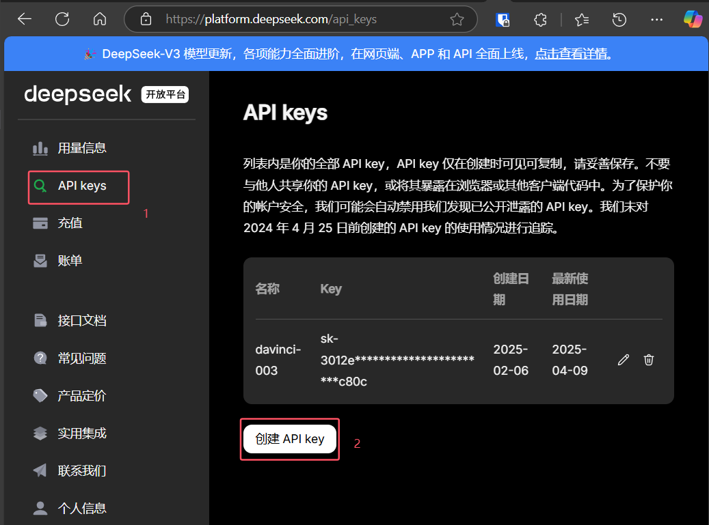

# 大模型智能验证配置

## 功能介绍

利用 AI 大模型的语义理解能力，对比 UN 报告与概要信息。

## 工作原理

### 验证流程

```
用户拖入 UN 报告或点击验证按钮
    ↓
读取 UN 报告文本
    ↓
大模型提取 UN 报告关键信息
    ↓
对比检验单数据与 UN 报告
    ↓
生成验证结果
```

### 技术架构

**组件说明：**

- **大模型服务器**：接收文件，调用大模型 API
- **AI 大模型**：DeepSeek / Moonshot（Kimi）

## 前置条件

1. **大模型服务器**
   - 需要部署独立的服务器
   - 负责调用大模型 API
   - 源码：[Aircraft 项目](https://github.com/initialencounter/Aircraft)

2. **大模型 API Key**
   - DeepSeek（推荐）或 Moonshot


## 配置步骤

### 第一步：申请大模型 API Key

#### 方式一：DeepSeek（强烈推荐）

**推荐理由：**

- 🎯 准确率高，适合专业场景

**申请步骤：**

1. 访问 [DeepSeek 开放平台](https://platform.deepseek.com/api_keys)
2. 注册并登录账号（支持手机号或邮箱）
3. 进入 API Keys 管理页面
4. 点击 **创建 API Key** 按钮
5. 输入密钥名称（如：Lims-验证）
6. 复制生成的 API Key（格式：sk-xxxxxxxxxxxxxx）
7. **重要**：保存好 API Key，创建后无法再次查看




#### 方式二：Moonshot（Kimi）

**特点：**

- 中文理解能力强
- 上下文窗口大（32K tokens）
- 速度极快

**申请步骤：**

1. 访问 [Moonshot 开放平台](https://platform.moonshot.cn/console/api-keys)
2. 注册并登录账号
3. 进入控制台，点击 **创建 API Key**
4. 复制生成的 API Key
5. 保存 API Key

### 第二步：部署大模型服务器

::: warning 重要
大模型服务器需要单独部署，不是插件的一部分。。
:::

#### 选项 A：下载预编译版本（推荐）

1. **下载服务器程序**
   - [点击下载 Windows 版本](https://github.com/initialencounter/Aircraft/releases/latest)

2. **运行服务器**
   - 双击安装运行

3. **保持运行**
   - 服务器需要在后台运行
   - 可以最小化控制台窗口
   - 建议添加到开机自启动

### 第三步：配置服务器

服务器启动后，需要配置大模型 API 信息。

#### 配置文件位置

Windows: `C:\Users\你的用户名\.aircraft\config.json`

#### 配置文件格式

**DeepSeek 配置示例：**

```json
{
  "llm": {
    "provider": "deepseek",
    "api_key": "sk-xxxxxxxxxxxxxx",
    "base_url": "https://api.deepseek.com",
    "model": "deepseek-chat"
  }
}
```

**Moonshot 配置示例：**

```json
{
  "llm": {
    "provider": "moonshot",
    "api_key": "sk-xxxxxxxxxxxxxx",
    "base_url": "https://api.moonshot.cn/v1",
    "model": "moonshot-v1-32k"
  }
}
```

#### 配置说明

| 字段     | 说明       | DeepSeek                 | Moonshot                   |
| -------- | ---------- | ------------------------ | -------------------------- |
| provider | 服务提供商 | deepseek                 | moonshot                   |
| api_key  | API 密钥   | 你的 API Key             | 你的 API Key               |
| base_url | API 地址   | https://api.deepseek.com | https://api.moonshot.cn/v1 |
| model    | 模型名称   | deepseek-chat            | moonshot-v1-32k            |

#### 重启服务器

配置完成后，重载服务使配置生效：

## 使用方法

### 方式一：拖拽上传

1. **打开检验单页面**
   - 在样品检验模块，打开任意检验单

2. **拖入 UN 报告**
   - 将 UN 报告 PDF 文件拖入浏览器窗口
   - 支持的格式：PDF

3. **拖入概要**
   - 将概要 Word 文件拖入浏览器窗口
   - 支持的格式：docx

4. **自动验证**

   ```
   插件会自动：
   → 读取概要数据
   → 上传 UN 报告到服务器
   → 调用大模型分析
   → 对比数据一致性
   → 显示验证结果
   ```
