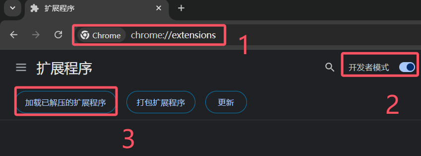

# 快速开始

本章节主要介绍插件的**安装、配置和使用**，帮助您快速上手。

## 系统要求

| 浏览器 | 支持版本 |
| --- | --- |
| Chrome 系 | Chrome、Edge、360 浏览器等 |
| Firefox | 最新稳定版 |

---

## 安装插件

### 方式一：商店安装（推荐）

> v3 版本起已将插件上传至各大应用商店，**通过商店安装后将自动更新**，无需手动维护。

| 商店 | 操作 |
| --- | --- |
| 360 应用商店 | [前往安装 →](https://ext.se.360.cn/#/extension-detail?id=dngoclgjgjoeonfakahfnkmgjkgnkjkp) |
| Microsoft Edge 外接程序 | [前往安装 →](https://microsoftedge.microsoft.com/addons/detail/lims/jpmajilpebfnbecdifmdcnajgikbjfdf) |
| Chrome 网上应用店 | [前往安装 →](https://chromewebstore.google.com/detail/lims/dngoclgjgjoeonfakahfnkmgjkgnkjkp) |

---

### 方式二：手动安装

#### Chrome — 拖拽安装（`.crx`）

::: details 点我展开
1. 在地址栏输入 `chrome://extensions` 并回车，进入扩展管理页面
2. 打开右上角的 **开发者模式** 开关
3. 将 `lims-xxx.chrome.crx` 文件**直接拖拽**到浏览器窗口中
::: 

#### Chrome — 解压安装（`.zip`）

::: details 点我展开

1. [点击下载 Chrome 版本](http://mines.initenc.cn:9191/https://github.com/initialencounter/Aircraft/releases/download/wxt-v3.0.6/lims-v3.0.6.chrome.zip)，下载完成后**解压到本地文件夹**
2. 在地址栏输入 `chrome://extensions` 并回车
3. 打开右上角的 **开发者模式** 开关
4. 点击 **加载已解压的扩展程序**，选择第 1 步解压的文件夹

::: warning 注意
手动安装新版本后，请务必**移除或停用**旧版插件，避免冲突。
:::

#### Firefox — `.xpi` 安装

::: details 点我展开
1. [点击下载 Firefox 版本](http://mines.initenc.cn:9191/https://github.com/initialencounter/Aircraft/releases/download/wxt-v3.0.6/lims-v3.0.6.firefox.xpi)
2. 将 `lims-xxx.firefox.xpi` 文件拖拽到 Firefox 浏览器窗口中

::: info 检查更新（Firefox v3.2+）
v3.2 起支持**插件内检查更新**：点击插件的齿轮图标 → 检查更新，此方式**不会丢失已有配置**。
:::
---

## 初始配置

安装完成后，进入插件选项页面完成初始配置：

::: details Chrome 系浏览器

1. 点击浏览器工具栏中的插件图标
2. 右键点击 **Lims** 插件图标
3. 选择 **选项**

:::

::: details Firefox 浏览器

1. 在地址栏输入 `about:addons` 并回车
2. 找到 **Lims** 插件
3. 点击插件旁的**齿轮图标** → 选择**选项**

:::

---

## 常见问题

### 插件安装后不生效？

- 确认插件状态为**已启用**
- 刷新 LIMS 系统页面后重试

### Chrome 浏览器每次启动都要重新加载插件？

- 这是部分旧版浏览器的已知限制，建议升级浏览器或改用商店版本

### 附件解析功能无法使用？

请逐项检查：

- **Everything** 是否已启动并正在运行
- Everything 能否搜索到项目概要文件（`.docx`）
- Everything 能否搜索到图片文件（`.pdf`）

---

## 获取帮助

如果遇到问题或有功能建议，可通过以下渠道获取支持：

- [功能介绍](./about.md) — 了解插件的完整功能
- [附件验证](./attachment.md) — 附件解析相关说明
- [大模型验证](./llm.md) — AI 辅助验证使用指南
- [验证规则](./rule.md) — 自定义验证规则配置
- [更新日志](./changelog.md) — 查看各版本变更记录
- [提交问题反馈](./issue.md) — 报告 Bug 或提出建议
