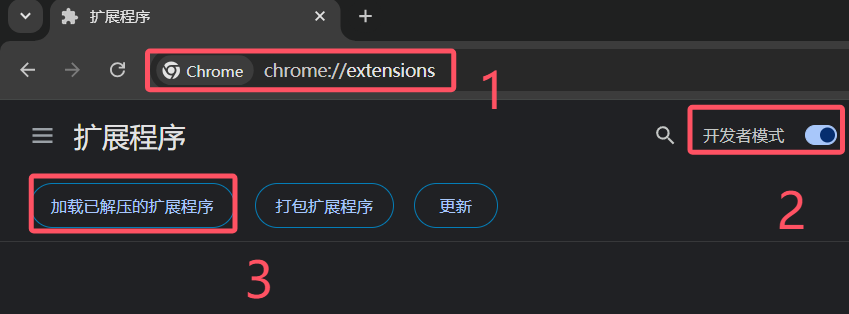

# 快速开始

本章节主要介绍插件的安装、配置和使用。

## 系统要求

- Chrome 系浏览器（Chrome、Edge、360浏览器等）或 Firefox 浏览器

## 安装插件

### Chrome 系浏览器安装

以下部分适用于 Chrome 系浏览器，包括：
- Google Chrome
- Microsoft Edge
- 360浏览器
- 其他基于 Chromium 的浏览器

::: warning 注意
Chrome 系浏览器除非是拖拽安装，安装完成后不要删除或移动解压的插件。
某些旧版浏览器仅支持临时加载，退出浏览器后需要重新加载。如遇到此问题，建议更新浏览器。
:::

#### 1. 下载插件

[点击下载 Chrome 版本](http://mines.initenc.cn:9191/https://github.com/initialencounter/Aircraft/releases/download/wxt-v3.0.6/lims-v3.0.6.chrome.zip) 👈 最新版本

下载后解压到本地文件夹。

#### 2. 加载插件

1. 在浏览器地址栏输入 `chrome://extensions` 并回车
2. 打开右上角的**开发者模式**开关
3. 点击**加载已解压的扩展程序**按钮
4. 选择解压后的文件夹

### Firefox 系浏览器安装

#### 1. 下载插件

[点击下载 Firefox 版本](http://mines.initenc.cn:9191/https://github.com/initialencounter/Aircraft/releases/download/wxt-v3.0.6/lims-v3.0.6.firefox.xpi) 👈 最新版本

#### 2. 安装插件

1. 在浏览器地址栏输入 `about:addons` 并回车
2. 点击右上角的**齿轮图标**
3. 选择**从文件安装附加组件**
4. 选择下载的 `.xpi` 文件
5. 在弹出的确认对话框中点击**添加**

## 初始配置

### 访问插件选项

安装完成后，需要配置插件以适应您的工作习惯：

**Chrome 系浏览器：**
1. 点击浏览器工具栏的插件图标
2. 右键点击 "Lims" 插件
3. 选择**选项**

**Firefox 浏览器：**
1. 打开 `about:addons`
2. 找到 "Lims" 插件
3. 点击插件旁边的**齿轮图标**
4. 选择**选项**

## 常见问题

### 1. 插件安装后不生效？

- 确认插件已启用
- 刷新 LIMS 系统页面

### 2. Chrome 浏览器每次启动都要重新加载插件？

- 这是某些旧版浏览器的限制

### 3. 附件解析功能无法使用？

检查以下几点：
- Everything 是否已启动
- Everything 是否能搜到项目概要 (.docx) 和图片 (.pdf)

## 获取帮助

如果遇到问题或有建议，可以：
- 查看 [功能介绍文档](./about.md)
- 查看 [附件验证文档](./attachment.md)
- 查看 [大模型验证文档](./llm.md)
- 查看 [验证规则文档](./rule.md)
- 查看 [更新日志](./changelog.md)
- [提交问题反馈](./issue.md)
